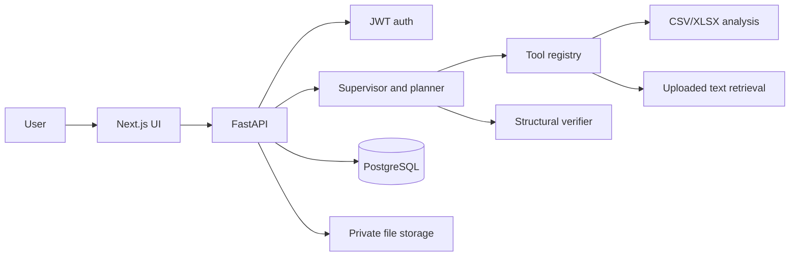

# Architecture

The API owns identity, task records, and file metadata. Plans and tool results are persisted in PostgreSQL. User files are stored under generated names outside the frontend's public assets. The current planner and verifier are intentionally simple; they provide real task and file workflows without claiming model reasoning. `app/llm.py` provides the initial model-provider boundary.

## Event lifecycle

The starter performs a task synchronously and returns its plan and result. For production-scale jobs, move execution to a background queue and stream event records over SSE. Never expose private model chain-of-thought; show status summaries only.
